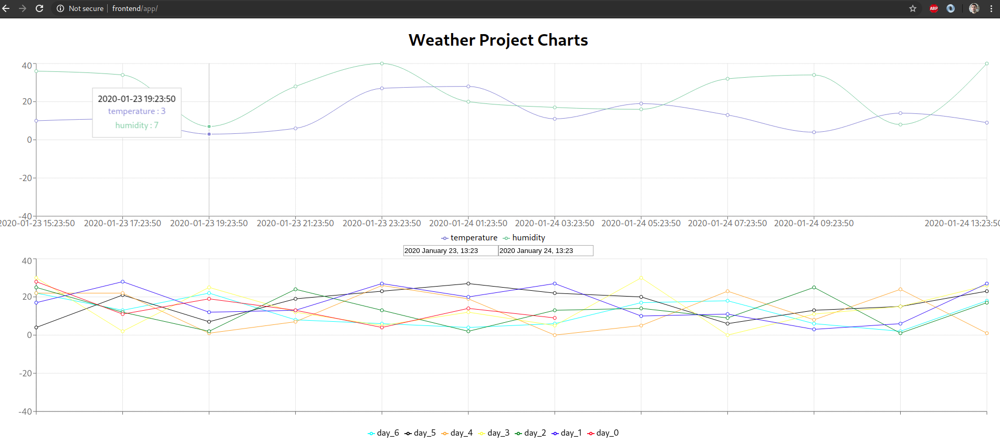

# weather-project
Collecting weather data from Raspberry Pi sensors

# Qucik start ftontend React
```bash
sudo pacman -S npm
npm install -g npm@latest
npm install 
npm start
```

# Quick start backend Flask
```bash
python -m venv venv3-weather
echo "venv3-weather" > .gitignore
source venv3-weather/bin/activate
pip install -r requirements.txt
```

# Start your app
```bash
source venv3-weather/bin/activate
export FLASK_APP=runner
flask run
```

# Example of usage
```bash
curl -X POST http://127.0.0.1:8000/api/v1/data
{"msg": "{'created': datetime.datetime(2020, 1, 16, 16, 29, 54, 137177), 'temperature': '13'} has been saved to database."}


curl -X GET  http://127.0.0.1:8000/api/v1/data
[{"created": "2020-01-16 16:22:37.719453", "temperature": "1"}, {"created": "2020-01-16 16:22:52.736508", "temperature": "28"}, {"created": "2020-01-16 16:22:53.632374", "temperature": "28"}, {"created": "2020-01-16 16:22:54.015451", "temperature": "0"}, {"created": "2020-01-16 16:22:54.222398", "temperature": "25"}, {"created": "2020-01-16 16:22:54.413553", "temperature": "27"}, {"created": "2020-01-16 16:22:54.589431", "temperature": "8"}, {"created": "2020-01-16 16:23:45.801641", "temperature": "21"}, {"created": "2020-01-16 16:27:43.142714", "temperature": "0"}, {"created": "2020-01-16 16:27:51.006740", "temperature": "23"}, {"created": "2020-01-16 16:27:51.910773", "temperature": "1"}, {"created": "2020-01-16 16:27:52.567149", "temperature": "30"}]
```


# Time selection
```bash

curl -X GET  "http://127.0.0.1:5000/api/v1/data"[{"created": "2020-01-17 00:26:39.349742", "temperature": "25"}, {"created": "2020-01-17 00:29:18", "temperature": "9"}, {"created": "2020-01-17 00:29:22", "temperature": "17"}, {"created": "2020-01-17 00:29:23", "temperature": "21"}, {"created": "2020-01-17 00:29:23", "temperature": "2"}, {"created": "2020-01-17 00:29:23", "temperature": "30"}, {"created": "2020-01-17 00:29:24", "temperature": "12"}, {"created": "2020-01-17 00:29:24", "temperature": "12"}, {"created": "2020-01-17 00:29:24", "temperature": "20"}, {"created": "2020-01-17 00:29:24", "temperature": "5"}, ...
{"created": "2020-01-17 00:36:41", "temperature": "7"}, {"created": "2020-01-17 00:36:42", "temperature": "28"}, {"created": "2020-01-17 00:36:42", "temperature": "26"}, {"created": "2020-01-17 00:36:42", "temperature": "24"}]

 curl -X POST "http://127.0.0.1:5000/api/v1/data/select?start=2020-01-17T00:35:07&end=2020-01-17T00:36:42"
[{"created": "2020-01-17 00:35:07", "temperature": "19"}, {"created": "2020-01-17 00:36:40", "temperature": "23"}, {"created": "2020-01-17 00:36:41", "temperature": "7"}]

```

# Docker Compose
https://dev.to/englishcraig/creating-an-app-with-docker-compose-django-and-create-react-app-31lf

```bash
cat /etc/hosts

...
127.0.0.1   frontend
127.0.0.1   backend
...
:wq!

docker-compose build
docker-compose up
```

 Navigate to a web browser and hit:

 http://frontend/app




Build backedn helm chart
```bash
sed -E \
-e 's/^(description:).*/\1 Raspberry Pi Backend helm chart/' \
-e 's/^(appVersion:).*/\1 0.0.1 /' \
-e '$a  \\ndependencies: \n- name: postgresql \n  version: "9.8.3" \n  repository: "https://charts.bitnami.com/bitnami" \n' \
-i backend/Chart.yaml


helm repo list
helm repo add bitnami https://charts.bitnami.com/bitnami
helm dependency update backend

sed -E \ 
-e 's/^(.*paths:).*/\1 ["\/api"]/' \
-e '/^ingress.*/,/^\s*tls:.*/s/^(.*-\shost: )(.*)/\1 raspberrypi--weather-monitoring/' \
-e '/^.*pullPolicy:.*/a \ \ containerPort: 8000' \
-e '/^.*pullPolicy:.*/a \ \ # Database connection settings:' \
-e '/^.*pullPolicy:.*/a \ \ env:' \
-e '/^.*pullPolicy:.*/a \ \ \ \ secret:' \
-e '/^.*pullPolicy:.*/a \ \ \ \ \ \ PSQL_DB_USER: "micro"' \
-e '/^.*pullPolicy:.*/a \ \ \ \ \ \ PSQL_DB_PASS: "password"' \
-e '/^.*pullPolicy:.*/a \ \ \ \ \ \ PSQL_DB_NAME: "microservice"' \
-e '/^.*pullPolicy:.*/a \ \ \ \ \ \ PSQL_DB_ADDRESS: "backend-postgresql"' \
-e '/^.*pullPolicy:.*/a \ \ \ \ \ \ PSQL_DB_PORT: "5432"' \
-e '$a \\nlivenessProbe: \/api\/health' \
-e '$a \\nreadinessProbe: \/api\/health' \
-e 's/^(.*repository:).*/\1 jantoth\/weather-backend/' \
-i backend/values.yaml


cat <<'EOF' >>backend/values.yaml

postgresql:
  image:
    registry: docker.io
    repository: bitnami/postgresql
    tag: latest
    debug: true

  global:
    postgresql:
      postgresqlUsername: postgres
      postgresqlPassword: password

  persistence:
    enabled: false

  pgHbaConfiguration: |
    local all all trust
    host all all localhost trust
    host microservice micro 10.42.0.0/16 password

  initdbScripts:
    db-init.sql: |
      CREATE DATABASE microservice;
      CREATE USER micro WITH ENCRYPTED PASSWORD 'password';
      GRANT ALL PRIVILEGES ON DATABASE microservice TO micro;
      ALTER DATABASE microservice OWNER TO micro;

EOF

sed -E \
-e 's/^(.*targetPort:).*/\1 {{ .Values.image.containerPort | default 80 }}/' \
-i backend/templates/service.yaml


# Setup "livenessProbe" and "readinessProbe" in backend/templates/deployment.yaml
sed -E \
-e '/^\s*livenessProbe:.*/,/^\s*port:.*/s/^(.*port:)(.*)/\1 {{ .Values.image.containerPort | default "http" }}/' \
-e '/^\s*readinessProbe:.*/,/^\s*port:.*/s/^(.*port:)(.*)/\1 {{ .Values.image.containerPort | default "http" }}/' \
-e '/^\s*livenessProbe:.*/,/^\s*port:.*/s/^(.*path:)(.*)/\1 {{ .Values.livenessProbe | default "\/" }}/' \
-e '/^\s*readinessProbe:.*/,/^\s*port:.*/s/^(.*path:)(.*)/\1 {{ .Values.readinessProbe | default "\/" }}/' \
-e 's/^(.*containerPort:).*/\1 {{ .Values.image.containerPort }}/' \
-e '/^.*image:.*/a \ \ \ \ \ \ \ \ \ \ env:' \
-e '/^.*image:.*/a \ \ \ \ \ \ \ \ \ \ {{- include "helpers.list-env-variables" . | indent 10 }}' \
-i backend/templates/deployment.yaml

# Creating file: "backend/templates/secret.yaml"
cat <<'EOF' >>backend/templates/secret.yaml
apiVersion: v1
kind: Secret
metadata:
  name: database-conection
type: Opaque
data:
  {{- range $key, $val := .Values.image.env.secret }}
  {{ $key }}: {{ $val | b64enc }}
  {{- end}}
      
EOF   


cat <<'EOF' >>backend/templates/_helpers.tpl

{{/*
Create the looper to define secret mounts as ENV variables
*/}}

{{- define "helpers.list-env-variables"}}
{{- range $key, $val := .Values.image.env.secret }}
- name: {{ $key }}
  valueFrom:
    secretKeyRef:
      name: database-conection
      key: {{ $key }}
{{- end}}
{{- end}}
EOF
```


Create frontend helm chart

```bash

helm create frontend

sed -E \
-e 's/^(description:).*/\1 Frontend React app helm chart/' \
-e 's/^(appVersion:).*/\1 0.0.1 /' \
-i frontend/Chart.yaml

sed -E \
-e 's/^(.*paths:).*/\1 ["\/app"]/' \
-e '/^ingress.*/,/^\s*tls:.*/s/^(.*-\shost: )(.*)/\1 raspberrypi--weather-monitoring/' \
-e '/^.*pullPolicy:.*/a \ \ containerPort: 80' \
-e '$a \\nlivenessProbe: \/app' \
-e '$a \\nreadinessProbe: \/app' \
-e 's/^(.*repository:).*/\1 jantoth\/weather-frontend/' \
-i frontend/values.yaml

sed -E \
-e 's/^(.*targetPort:).*/\1 {{ .Values.image.containerPort | default 80 }}/' \
-i frontend/templates/service.yaml

sed -E \
-e '/^\s*livenessProbe:.*/,/^\s*port:.*/s/^(.*port:)(.*)/\1 {{ .Values.image.containerPort | default "http" }}/' \
-e '/^\s*readinessProbe:.*/,/^\s*port:.*/s/^(.*port:)(.*)/\1 {{ .Values.image.containerPort | default "http" }}/' \
-e '/^\s*livenessProbe:.*/,/^\s*port:.*/s/^(.*path:)(.*)/\1 {{ .Values.livenessProbe | default "\/" }}/' \
-e '/^\s*readinessProbe:.*/,/^\s*port:.*/s/^(.*path:)(.*)/\1 {{ .Values.readinessProbe | default "\/" }}/' \
-e 's/^(.*containerPort:).*/\1 {{ .Values.image.containerPort }}/' \
-i frontend/templates/deployment.yaml
```


